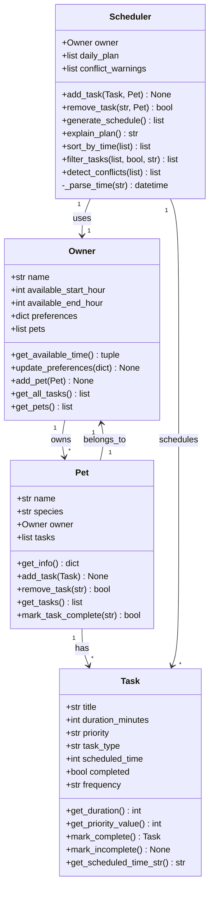

# PawPal+ UML Class Diagram (Final)

## Class Descriptions (Final Implementation)

### Owner
- **Attributes**: 
  - `name`: Owner's name
  - `available_start_hour`: When owner's day starts (0-23)
  - `available_end_hour`: When owner's day ends (0-23)
  - `preferences`: Dictionary of owner preferences
  - `pets`: List of Pet instances owned by this owner
- **Methods**:
  - `get_available_time()`: Returns tuple of (start_hour, end_hour)
  - `update_preferences(prefs)`: Updates owner preferences dictionary
  - `add_pet(pet)`: Adds a pet to the owner's pet list
  - `get_all_tasks()`: Returns list of all tasks from all pets
  - `get_pets()`: Returns list of all pets

### Pet
- **Attributes**:
  - `name`: Pet's name
  - `species`: Type of pet (dog, cat, etc.)
  - `owner`: Reference to Owner instance
  - `tasks`: List of Task instances for this pet
- **Methods**:
  - `get_info()`: Returns dictionary with pet information
  - `add_task(task)`: Adds a task to this pet's task list
  - `remove_task(task_title)`: Removes a task by title, returns True if found
  - `get_tasks()`: Returns list of all tasks for this pet
  - `mark_task_complete(task_title)`: Marks task complete and handles recurring tasks

### Task
- **Attributes**:
  - `title`: Task name/description
  - `duration_minutes`: How long the task takes
  - `priority`: Priority level ("low", "medium", "high")
  - `task_type`: Type of task (walk, feeding, meds, enrichment, grooming, etc.)
  - `scheduled_time`: Hour of day (0-23) when task is scheduled (optional)
  - `completed`: Boolean indicating if task is completed
  - `frequency`: Recurrence frequency ("daily", "weekly", or None)
- **Methods**:
  - `get_duration()`: Returns duration in minutes
  - `get_priority_value()`: Returns numeric priority (1=low, 2=medium, 3=high)
  - `mark_complete()`: Marks task complete, returns new Task instance if recurring
  - `mark_incomplete()`: Marks task as not completed
  - `get_scheduled_time_str()`: Returns scheduled time as HH:MM string

### Scheduler
- **Attributes**:
  - `owner`: Owner instance
  - `daily_plan`: Generated schedule for the day (list of dicts)
  - `conflict_warnings`: List of conflict warning messages
- **Methods**:
  - `add_task(task, pet)`: Adds a task to a pet's task list
  - `remove_task(task_title, pet)`: Removes a task by title from a pet
  - `generate_schedule()`: Creates daily schedule based on constraints and priorities
  - `explain_plan()`: Returns explanation of why tasks were scheduled
  - `sort_by_time(tasks)`: Sorts tasks by scheduled time (chronological)
  - `filter_tasks(tasks, completed, pet_name)`: Filters tasks by completion status and/or pet name
  - `detect_conflicts(schedule)`: Detects scheduling conflicts and returns warnings
  - `_parse_time(time_str)`: Helper method to parse HH:MM time string
