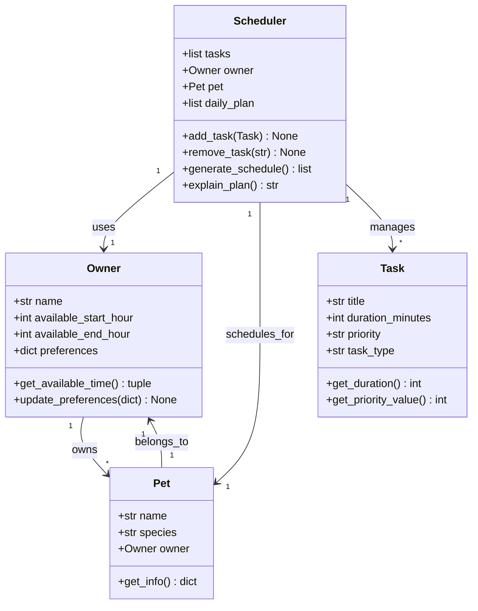

# PawPal+ UML Class Diagram

## Class Descriptions

### Owner
- **Attributes**: 
  - `name`: Owner's name
  - `available_start_hour`: When owner's day starts (0-23)
  - `available_end_hour`: When owner's day ends (0-23)
  - `preferences`: Dictionary of owner preferences (e.g., preferred walk times)
- **Methods**:
  - `get_available_time()`: Returns tuple of (start_hour, end_hour)
  - `update_preferences(prefs)`: Updates owner preferences

### Pet
- **Attributes**:
  - `name`: Pet's name
  - `species`: Type of pet (dog, cat, etc.)
  - `owner`: Reference to Owner instance
- **Methods**:
  - `get_info()`: Returns dictionary with pet information

### Task
- **Attributes**:
  - `title`: Task name/description
  - `duration_minutes`: How long the task takes
  - `priority`: Priority level ("low", "medium", "high")
  - `task_type`: Type of task (walk, feeding, meds, enrichment, grooming)
- **Methods**:
  - `get_duration()`: Returns duration in minutes
  - `get_priority_value()`: Returns numeric priority (1=low, 2=medium, 3=high)

### Scheduler
- **Attributes**:
  - `tasks`: List of Task objects
  - `owner`: Owner instance
  - `pet`: Pet instance
  - `daily_plan`: Generated schedule for the day
- **Methods**:
  - `add_task(task)`: Adds a task to the scheduler
  - `remove_task(task_title)`: Removes a task by title
  - `generate_schedule()`: Creates daily schedule based on constraints
  - `explain_plan()`: Returns explanation of why tasks were scheduled
